 # Praktikum 6

## Latihan 

Dictionary adalah Koleksi item yang berasosiasi dimana setiap pasangan terdiri _key_ dan _value_.

_Key_ dan _Value_ sebagai 'Key' : 'Value'

Dictionary ditulis dengan dipisahkan koma dalam ```{}```

seperti:

```
telepon = {'Ari' : '081267888', 'Dina' : '087677776'}
```

Untuk menambahkan elemen dictionary 

```
telepon['Riko'] = '087654544'
```

dan untuk menampilkan kontak 
```
print(telepon['Ari'])
```

untuk mengubah dictionary

```
telepon['Dina'] = '088999776'
```
Untuk menampilkan hasil semua nama/key nya menggunakan perintah

```
print(telepon.keys())
```

hasil yang dikeluarkan

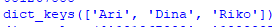

Untuk menampilkan semua nomor telepon/value

```
print(telepon.values())
```

hasil yang dikeluarkan

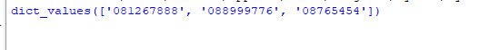

Daftar Nama dan Nomor menggunakan perintah ```for```

```
for nama,nomor in telepon.items():
    print("%s \t| %s " % (nama,nomor))
```

Output nya akan menghasilkan

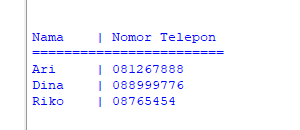

Untuk menghapus kontak Dina bisa menggunakan ```del``` 
seperti:

``` 
del telepon['Dina']
```

Maka kontak Dina akan terhapus

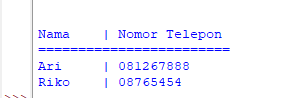

---

## Tugas Praktikum

Buat dictionary kosong
```
siswa = {}
```

- membuat kondisi perulangan dan sebuah keterangan untuk memilih menu yang akan di jalankan program

```
while True:
    data = input("\n(T)ambah, (U)bah, (H)apus, (C)ari, (L)ihat, (K)eluar: ")
```

- program untuk menambahkan data
```
if data.lower() == 't':
        print("Tambah Data")
        nama = input("Nama           : ")
        nim = int(input("NIM            : "))
        tugas = int(input("Nilai Tugas    : "))
        uts = int(input("Nilai UTS      : "))
        uas = int(input("Nilai UAS      : "))
        akhir = tugas*30/100 + uts*35/100 + uas*35/100
        siswa[nama] = nim, tugas, uts, uas, akhir
```

- hasil yang keluar ketika kita memberi perintah 't' dan diminta untuk mengisi beberapa data

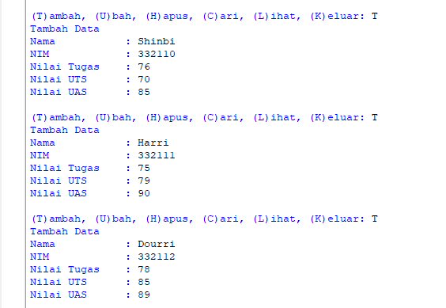

- ketika sudah menambahkan maka hasilnya seprti:

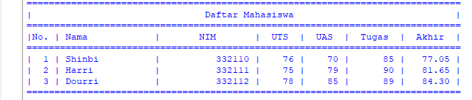

- program untuk mengubah data
```
elif data.lower() == 'u':
        print("Ubah Data")
        nama = input("Masukkan Nama  : ")
        if nama in siswa.keys():
            nim = int(input("NIM            : "))
            tugas = int(input("Nilai Tugas    : "))
            uts = int(input("Nilai UTS      : "))
            uas = int(input("Nilai UAS      : "))
            akhir = tugas * 30 / 100 + uts * 35 / 100 + uas * 35 / 100
            siswa[nama] = nim, tugas, uts, uas, akhir
        else:
            print("Nama {0} tidak ditemukan".format(nama))
```

- hasil yang keluar ketika kita memerintahkan 'u' untuk untuk mengubah data yang kita inginkan

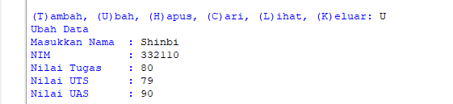

 -ketika sudah keluar ketika di lihat kembali hasilnya seprti:
 
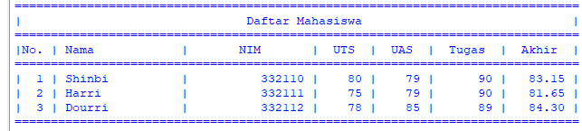

- program untuk menghapus data
```
elif data.lower() == 'h':
        print("Hapus Data")
        nama = input("Masukkan Nama  : ")
        if nama in siswa.keys():
            del siswa[nama]
        else:
            print("Nama {0} Tidak Ditemukan".format(nama))
```

- ketika kita ingin menghapus data maka kita mengitput 'H' untuk menghapusnya

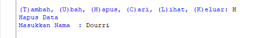

- program untuk mencari data
```
 elif data.lower() == 'c':
        print("Cari Data")
        nama = input("Masukkan Nama : ")
        if nama in siswa.keys():
            print("="*73)
            print("|                             Daftar Mahasiswa                          |")
            print("="*73)
            print("| Nama            |       NIM       |  UTS  |  UAS  |  Tugas  |  Akhir  |")
            print("="*73)
            print("| {0:15s} | {1:15d} | {2:5d} | {3:5d} | {4:7d} | {5:7.2f} |"
                  .format(nama, nim, uts, uas, tugas, akhir))
            print("="*73)
        else:
            print("Nama {0} Tidak Ditemukan".format(nama))
 ```
 
 - hasil kekita diminta untuk mencari data dengan menginputkan 'C'
 
 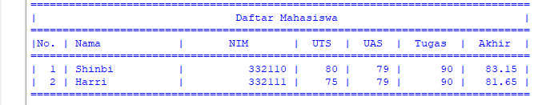
 
 - program untuk melihat data
 ```
 elif data.lower() == 'l':
        if siswa.items():
            print("="*78)
            print("|                               Daftar Mahasiswa                             |")
            print("="*78)
            print("|No. | Nama            |       NIM       |  UTS  |  UAS  |  Tugas  |  Akhir  |")
            print("="*78)
            i = 0
            for j in a.items():
                i += 1
                print("| {no:2d} | {0:15s} | {1:15d} | {2:5d} | {3:5d} | {4:7d} | {5:7.2f} |"
                      .format(j[0][:13], j[1][0], j[1][1], j[1][2], j[1][3], j[1][4], no=i))
            print("=" * 78)
        else:
            print("="*78)
            print("|                               Daftar Mahasiswa                             |")
            print("="*78)
            print("|No. | Nama            |       NIM       |  UTS  |  UAS  |  Tugas  |  Akhir  |")
            print("="*78)
            print("|                                TIDAK ADA DATA                              |")
            print("="*78)
```

- hasil yang keluar jika belum menginput data maka akan memberikan hasil "TIDAK ADA DATA"

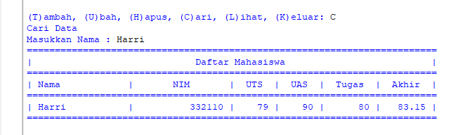

- hasil yangkeluar jika sudah menginput data

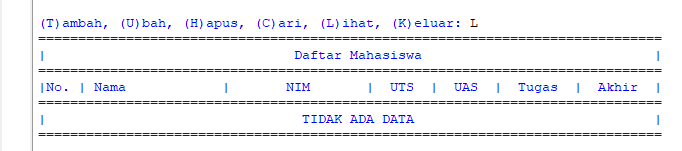

-program untuk keluar dari data
```
elif b.lower() == 'k':
        break
```
